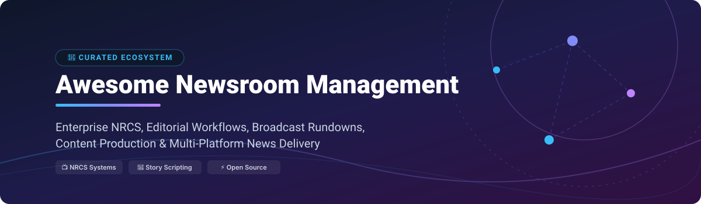

# 📰 Awesome Newsroom Management 🚀

 

---

## 💡 Overview & SEO Scope 🔍

Welcome to **Awesome Newsroom Management**, the premier curated index of **Newsroom Computer Systems (NRCS)**, **Editorial Workflow Engines**, **Media Asset Management (MAM)**, and **Multi-Platform News Publishing Software**.

Whether you operate a broadcast television network, radio station, investigative reporting collective, or digital-first publication, this repository provides data on commercial enterprise SaaS platforms and leading open-source software powering modern journalism.

---

## 📑 Table of Contents 📌

- [📊 Market Overview \& Sector Structure](#-market-overview--sector-structure-)
- [🏢 SaaS \& Commercial Platforms](#-saas--commercial-platforms-)
- [⚡ Open-Source GitHub Projects](#-open-source-github-projects-)
- [🤝 How to Contribute](#-how-to-contribute-)
- [📜 Disclaimer](#-disclaimer-)
- [💖 Support \& Community](#-support--community-)
- [📈 Star History](#-star-history-)

---

## 📊 Market Overview & Sector Structure 📈

The global **Newsroom Computer Systems (NRCS) & Media Asset Management (MAM)** market size is estimated at **$3.2 Billion (2026)** and is expanding at a CAGR of ~6.8%. The market is **moderately fragmented**: legacy broadcast titans (*Avid*, *AP ENPS*, *Dalet*) dominate mission-critical television and radio stations requiring deep MOS protocol and playout automation, while cloud-native SaaS platforms (*Arc XP*, *Flowics*, *Kordiam*) and specialized open-source tools (*Superdesk*, *Ghost*, *Strapi*) capture rapid adoption in multi-channel and digital-first media outlets.

---

## 🏢 SaaS & Commercial Platforms 💼

> **Note:** The table below is sorted by **Company Size / Valuation / Revenue** in descending order.

| 🏢 Product / Platform | 📊 Company Size (Valuation / Revenue) | 💵 Starting Price | 🎁 Free Tier / Trial Limit | 📝 Key Capabilities & Description |
| :--- | :--- | :--- | :--- | :--- |
| **[Avid iNEWS](https://www.avid.com/)** | **~$1.40 Billion** Valuation ($425M Revenue) | ~$2,500 / month (base broadcast station license) | No free tier (14-day sales test server upon contract request) | Industry-standard broadcast NRCS for rundown management, story scripting, teleprompter integration, and Avid MediaCentral workflow orchestration. |
| **[ENPS (Associated Press)](https://www.ap.org/enps/)** | **~$300 Million** Annual Revenue | ~$1,500 / month (entry TV/radio station license) | No free tier (14-day interactive demo available upon sales inquiry) | Enterprise newsroom computer system built by AP for wire ingest, scriptwriting, rundown control, assignment desks, and studio automation. |
| **[CUE Newsroom](https://www.stibodx.com/)** *(Stibo DX)* | **~$300 Million** Group Revenue | ~$1,800 / month (starter media org license) | 14-day requested test workspace (no permanent free plan) | Modern digital-first newsroom and digital asset ecosystem unifying print, web, mobile, and multichannel publishing workflows. |
| **[Flowics](https://www.flowics.com/)** *(Vizrt Group)* | **~$150 Million** Group Revenue | ~$250 / month (starter live graphics plan) | 14-day full-featured free trial (no credit card required) | Cloud-native HTML5 graphics and real-time interactive audience engagement system for live news broadcasts and web streams. |
| **[Arc XP](https://www.arcxp.com/)** *(Graham Holdings)* | **~$100 Million** Annual Revenue | ~$5,000 / month ($60,000 / year base entry) | No free tier (14-day requestable sandbox demo for enterprise evaluations) | Enterprise digital publishing and newsroom platform supporting end-to-end content management, subscriber paywalls, and video delivery. |
| **[Dalet Galaxy](https://www.dalet.com/)** | **~$70 Million** Annual Revenue | ~$2,000 / month (base newsroom deployment) | 30-day sandbox demo account upon sales agreement | Unified news production, MAM, and workflow orchestration platform managing ingest, editing, rundowns, and multi-platform playout. |
| **[Octopus Newsroom](https://www.octopus-news.com/)** | **~$15 Million** Annual Revenue | ~$1,200 / month (small news team tier) | 14-day requested test instance (requires server connection) | Story-centric NRCS software for TV, radio, and web newsrooms offering MOS protocol integration, rundown management, and mobile apps. |
| **[Kordiam](https://www.kordiam.io/)** *(formerly Desk-Net)* | **~$8 Million** Annual Revenue | €299 / month (~$325/mo for up to 10 users) | 14-day free trial (full features, self-serve onboarding) | Cross-media editorial planning, coverage scheduling, and story desk management tailored for print, online, and broadcast teams. |
| **[NewsBoss](https://www.newsboss.com/)** | **~$5 Million** Annual Revenue | ~$450 / month (radio newsroom starter pack) | 30-day trial version available upon sales request | Complete radio newsroom management solution delivering audio editing, wire ingest, story scripting, and automated broadcast playout. |

---

## ⚡ Open-Source GitHub Projects 🛠️

> **Note:** The table below is sorted by **GitHub Stars_Count** in descending order. Click on any Stars_Badge to visit the stargazers page!

| ⭐ Stars | 📦 Project / Repository | ⚙️ Language / Stack | 📝 Description & Scope |
| :---: | :--- | :--- | :--- |
|  | **[Strapi](https://github.com/strapi/strapi)** | TypeScript / Node.js | Leading open-source headless CMS widely customized for digital newsrooms, media APIs, and multi-channel publishing pipelines. |
|  | **[Ghost](https://github.com/TryGhost/Ghost)** | JavaScript / Node.js | Independent open-source publishing, membership, subscription, and newsletter platform engineered for digital newsrooms. |
|  | **[OpenRefine](https://github.com/OpenRefine/OpenRefine)** | Java | Essential data cleaning, entity resolution, and transformation power tool for investigative data journalists and news desks. |
|  | **[SecureDrop](https://github.com/freedomofpress/securedrop)** | Python / Tor | Open-source whistleblower submission system deployed by major news organizations globally for secure leak collection. |
|  | **[Aleph](https://github.com/alephdata/aleph)** | Python / Angular | Document search and entity analysis platform built by OCCRP for investigative reporters combing through large leak archives. |
|  | **[Coral Talk](https://github.com/coralproject/talk)** | JavaScript / GraphQL | Open-source newsroom comment management and audience engagement platform created by Vox Media & Mozilla. |
|  | **[Awesome Interactive Journalism](https://github.com/wbkd/awesome-interactive-journalism)** | Markdown | Curated collection of interactive journalism tools, data visualizations, and newsroom storytelling repositories. |
|  | **[Letterpad](https://github.com/letterpad/letterpad)** | TypeScript / Next.js | Modern open-source publishing framework designed for independent journalists, writers, and editorial content creators. |
|  | **[Superdesk](https://github.com/superdesk/superdesk)** | Python / AngularJS | Standout open-source end-to-end newsroom computer system (NRCS) and editorial platform developed by Sourcefabric. |
|  | **[Superdesk Web Publisher](https://github.com/superdesk/web-publisher)** | PHP / Symfony | Next-generation open-source web publishing platform designed to seamlessly publish content generated from Superdesk. |
|  | **[Superdesk Client Core](https://github.com/superdesk/superdesk-client-core)** | JavaScript | Reusable front-end UI components, editorial modules, and client-side framework powering Superdesk news applications. |
|  | **[Superdesk Core](https://github.com/superdesk/superdesk-core)** | Python | Foundational server APIs, ingest processing engines, and core data services powering Superdesk NRCS backends. |
|  | **[Superdesk Newsroom](https://github.com/superdesk/newsroom)** | Python / JS | Secure content repository and distribution interface (Newshub) for media agencies delivering stories to wire subscribers. |
|  | **[Superdesk Planning](https://github.com/superdesk/superdesk-planning)** | Python / JS | Editorial calendar, assignment management, and coverage planning extension built for Superdesk newsrooms. |

---

## 🤝 How to Contribute 🛠️

Contributions are warmheartedly welcomed! Help keep this newsroom technology ecosystem accurate and up to date:

1. **Fork** this repository.
2. Edit `README.md` following the existing markdown table structure.
3. Ensure all SaaS entries include explicit starting prices, trial terms, and estimated corporate metrics.
4. For open-source additions, include the correct `img.shields.io` Stars_Badge pointing to the stargazer URL.
5. Submit a **Pull Request** with a brief summary of your updates.

---

## 📜 Disclaimer ⚖️

- This is a **community-curated index** for informational and educational purposes.
- Newsroom systems manage high-stakes, time-sensitive broadcast and publishing pipelines; always conduct independent technical evaluation before production deployment.
- Product names, logos, and trademarks belong to their respective corporate owners.

---

## 💖 Support & Community 🌟

Thank you for exploring **Awesome-Newsroom-Management**! 📰  
If you find this curated ecosystem list helpful for your newsroom, media organization, or research, please consider supporting the project:

- ⭐ **Star this repository** to show your appreciation and boost visibility.
- 🔀 **Fork & Contribute** to submit new open-source tools or SaaS updates.
- 📢 **Share with colleagues**, journalists, and newsroom technologists.
- ☕ **Sponsor / Buy me a coffee**: Support ongoing open-source curation on the [Sponsor Dashboard](https://github.com/sponsors/ishandutta2007).

---

## 📈 Star History 📊

